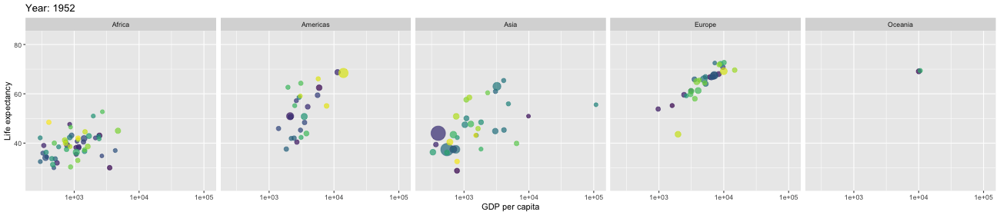

<style>
.gdbar img {
  width: 150px !important;
  height: 80px !important;
  margin: 8px 8px;
}

.gdbar {
  width: 200px !important;
  height: 100px !important;
}

</style>

<style type="text/css">
body, p, div, h1, h2, h3, h4, h5, ul {
  color: black;
  font-family: Modern Computer Roman;
}
h2 {
color: #8C1D40;
}

</style>


<style type="text/css">
slides > slide:not(.nobackground):after {
  content: '';
}
</style>

<style type="text/css">
slides > slide {
  background: linear-gradient(#ffffff, #ffffff 85%, #ffffff);
  background-color: white;
  }
</style>


```{r setup, include=FALSE}
knitr::opts_chunk$set(echo = TRUE, comment = "", cache=F)
library(animation)
library(magrittr)
library(plotly)
```


## {.smaller}

Reference:


* Yihui Xie, `animation`*: An R Package for Creating Animations and Demonstrating Statistical Methods*, Journal of Statistics, April 2013, Vol. 53, Issue 1.

* [A gallery of animations with animation package](https://yihui.org/animation/), Yihui Xie 

* <https://gganimate.com/articles/gganimate.html>, Thomas Lin Pedersen, David Robinson

* <https://www.gapminder.org/>


{width="800" height="170"}


## `animation` Package; Basic Scheme {.smaller}


```{r, eval=F}
library(animation)

##specify parameters of the animation
ani.options(interval = 0.2, nmax = 10) 

##begin for-loop to create frames
for (i in 1:ani.options("nmax")) {
    ## draw the i-th plot/frame
    ani.pause()  ## take a pause before moving to the next frame
                 ## for a time interval specified by ani.options("interval")
}  ## end of for-loop that creates frames

```

The last command sets interval pause between frames, and max number of iterations/frames. Unlike `nmax` it seems that setting `interval` only works in script files. When you use code in Rmd file to create animation to automatically embed in pdf or html, you would need to set `interval` value in the code chunk options (see example below). 

The function `ani.options()` sets or querys a list of animation parameters.
```{r}
str(ani.options())
```


## {.smaller}

To query the current value of maximum number of frames `nmax`, we type
```{r}
ani.options("nmax")
```

As we did in the above code snippet, to set `nmax`, say, to 21 frames, we type
```{r}
ani.options(nmax=21)

 ## check that we did change the value of nmax
ani.options("nmax")
```

## Saving Animation {.smaller}

Use `saveHTML()`, `saveGIF()` or `saveVideo()` function from `animation` package to save your animation in a desired format.

For example, function `saveHTML` first records all the plots in the R expression as bitmap images, then inserts them into an HTML page and finally creates the animation using the SciAnimator library.


```{r, eval=F}
saveHTML(expr, img.name = "Rplot", global.opts = "", single.opts = "", 
    navigator = ani.options("nmax") <= 100 && ani.options("interval") >= 
        0.05, htmlfile = "index.html", ...)
```

Here, `expr` is any expression (i.e. code) for creating images and should be wrapped with `{}`.

Try some examples at <https://yihui.org/animation/example/savehtml/>

## Animation in HTML from Rmd {.smaller}

In order to embed `animation`-created animation into HTML file produced by Rmd, you can use chunk option `animation.hook="gifski"`. This creates a gif file, which consists of the sequence of `nmax` frames and gif image format supports image sequencing into a frame. By default, the gif file is stored in the folder automatically created in the directory where your Rmd file is. The alternative to using the animation hook is to install ffmpeg software (free at <https://www.ffmpeg.org/download.html>) and instead of animation hook, use the chunk option `fig.show="animate"`.  

Example:

Using the chunk options

```` ```{r conf_int, fig.width=5, fig.height=4, cache=F, animation.hook="gifski", interval=0.1, fig.align="center"} ````

the following code simulates computation of 100 confidence intervals of sample mean $\displaystyle \bar{X}_n = {1\over n} \sum_{i=1}^n X_i$, each computed from an independent sample from $\mathcal{N}(0,1)$ distribution and each being of sample size $n=50$.

## {.smaller}

```{r conf_int, fig.width=5, fig.height=4, cache=F, animation.hook="gifski", interval=0.1, fig.align="center"}
library(animation)
ani.options(interval = 0.2, nmax = 100)
## 90% interval
sample_size=50
conf.int(level=0.9, size=sample_size, 
         main=paste("Simulation of ",ani.options()$nmax,
                    " Confidence Intervals \nEach sample size: n = ",sample_size))
```


## {.smaller}

```{r brownian, fig.width=5, fig.height=4, cache=T, animation.hook="gifski", interval=0.1, fig.align="center"}
library(animation)
set.seed(123) ##set a seed of pseudo-random generation, to always produce same animation
## sample size; initial x values; initial y values
n = 10;  x = rnorm(n);  y = rnorm(n)

ani.options(nmax=60)
for (i in seq_len(ani.options("nmax"))) {
   dev.hold()
   plot(x, y, xlim = c(-20,20), ylim = c(-20,20), col=1:n, pch=19, cex=2)
   x = x + rnorm(n) #update x
   y = y + rnorm(n) #update y
   ani.pause()
}

```


## Animation in PDF {.smaller}

Yes! You can have an animation in PDF. This is done in the same way except that in the code chunk options, instead of `animation.hook="gifski"`, you should have `fig.show="animate"`. Also, in the chunk options, you can put `aniopts="<some options>"` where in between quotation marks you can put: `autoplay` for animation to start automatically upon opening the pdf file; `controls` for including user control buttons; `loop`, for infinite loop (unless the user stops it). If you want to use more than one of these options, separate them by commas.

For instance, in the previos example, if the code chunk uptions are replaced by

```` ```{r, cache=T, fig.show='animate', interval=0.1, aniopts="autoplay,loop,controls", fig.align="center"}
``` ````

we get the following

<center>
{width=60%}
</center>
Upon opening PDF file user can control animation using control buttons.

## `gganimate` Package {.smaller}

We use data from `gapminder` package.

```{r, warning=F}
library(gapminder)
head(gapminder)
```

 
## `gganimate` Package  {.smaller}

```{r, cache=T, interval=0.01, message = F, warning = F, results = F, out.width="100%", fig.height=4}
library(gganimate)
library(gapminder)
library(ggplot2)

gapmdr <- ggplot(gapminder, 
  aes(x = gdpPercap, y=lifeExp, size = pop, colour = country)) +
  geom_point(show.legend = FALSE, alpha = 0.7) +
  scale_color_viridis_d() +
  scale_size(range = c(2, 12)) +
  scale_x_log10() +
  labs(x = "GDP per capita", y = "Life expectancy")

gapmdr <- gapmdr + facet_wrap(~continent, nrow=1) +
  transition_time(year) +
  labs(title = "Year: {frame_time}")


 ## save image in current folder 
 ##(you can provide path to another folder instead of just "gapmdr.gif")
anim_save("gapmdr.gif", gapmdr, width=1300, height=280)

```

The image sequence `gapmdr.gif` (which is actually your animation) was created in the current folder/directory. 


## {.smaller}

To include the animation in html output file, type the syntax for including images (**not** in a code chunk). For example, `gapmdr.gif` file created in the previous slide is included in this (html) slide by typing:

`{width="800" height="170"}`

{width="800" height="170"}
